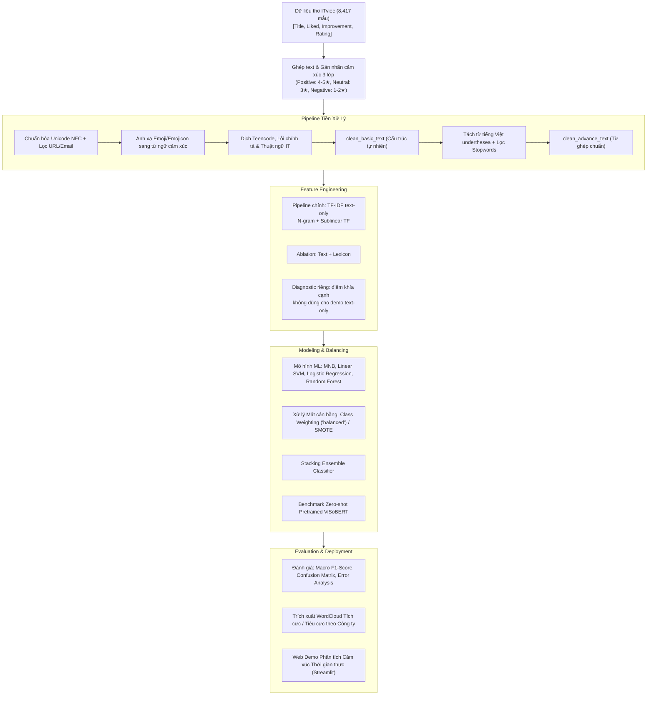

# Đồ Án Cuối Môn NLP: Phân Tích Cảm Xúc (Sentiment Analysis) Đánh Giá ITviec

## 1. Giới thiệu Đề tài
Dự án tập trung chuyên sâu vào bài toán **Phân tích Cảm xúc (Sentiment Analysis)** từ dữ liệu đánh giá của nhân viên và ứng viên trên nền tảng **ITviec**.

* **Repository:** [https://github.com/mrkiss-it/NLP-Sentiment-Analysis-ITviec](https://github.com/mrkiss-it/NLP-Sentiment-Analysis-ITviec)

### Mục tiêu chính:
1. **Phân loại cảm xúc đa lớp (Multi-class Sentiment Classification):** Tự động phân loại đánh giá thành 3 sắc thái: **Tích cực (Positive)**, **Tiêu cực (Negative)**, **Trung tính (Neutral)**.
2. **So sánh đa dạng mô hình:** Thử nghiệm, tinh chỉnh và so sánh hiệu năng của ít nhất 4 thuật toán Machine Learning (Multinomial Naive Bayes, Logistic Regression, Linear SVM, Random Forest), mô hình kết hợp **Stacking Ensemble Classifier**, và mô hình Pretrained Transformer (**ViSoBERT / PhoBERT**).
3. **Phân tích Insight cảm xúc doanh nghiệp:** Trích xuất các từ khóa tích cực/tiêu cực đặc trưng (WordCloud) theo từng công ty công nghệ cụ thể và phân tích các yếu tố ảnh hưởng đến độ hài lòng của nhân sự.
4. **Xây dựng ứng dụng Demo (Deployment):** Tạo giao diện trực quan (Streamlit / Gradio) cho phép nhập đánh giá và dự đoán cảm xúc theo thời gian thực.

---

## 2. Ý Tưởng & Phương Pháp Giải Quyết Bài Toán (Problem Formulation & Solution Approach)

### 2.1. Bản chất Bài toán & Xử lý Ghép Văn bản (Text Aggregation)
- **Bản chất dữ liệu:** Dữ liệu gốc thu thập từ ITviec gồm 8,417 đánh giá thực tế của nhân viên và ứng viên. Mỗi đánh giá được chia thành 3 phần độc lập: `Title` (Tiêu đề), `What I liked` (Điểm thích/Khen ngợi) và `Suggestions for improvement` (Đề xuất cải thiện/Góp ý/Chê).
- **Ý tưởng ghép trường văn bản:** Để mô hình có góc nhìn toàn diện về toàn bộ ý kiến đánh giá, ta tiến hành nối 3 trường này lại thành chuỗi văn bản hợp nhất:
```text
raw_review_text = Title + " . " + What I liked + " . " + Suggestions for improvement
```

### 2.2. Chiến lược Gán nhãn yếu từ Rating (Rating-derived Weak Labels)
Để xây dựng bộ dữ liệu huấn luyện ban đầu, dự án dùng điểm đánh giá **`Rating` (từ 1 đến 5 sao)** do người viết review chấm để tạo nhãn yếu (*weak labels / distant supervision*). Nhãn này là đại diện gần đúng cho cảm xúc tổng thể, không phải ground truth được con người kiểm định trực tiếp từ nội dung văn bản:

| Số sao (`Rating`) | Nhãn Cảm xúc (`Sentiment`) | Ý nghĩa nghiệp vụ | Số lượng mẫu | Tỷ lệ (%) |
| :---: | :---: | :--- | :---: | :---: |
| ⭐⭐⭐⭐⭐ (5 sao)<br>⭐⭐⭐⭐ (4 sao) | **`Positive`** *(Tích cực)* | Đánh giá thể hiện sự hài lòng cao về môi trường, chế độ đãi ngộ, văn hóa làm việc và ban lãnh đạo. | 6,208 | 73.76% |
| ⭐⭐⭐ (3 sao) | **`Neutral`** *(Trung tính)* | Đánh giá ở mức trung hòa, cân bằng; nội dung thường có cả điểm khen lẫn điểm chê tương đương nhau. | 1,639 | 19.47% |
| ⭐⭐ (2 sao)<br>⭐ (1 sao) | **`Negative`** *(Tiêu cực)* | Đánh giá thể hiện sự thất vọng, bức xúc về chính sách OT, quản lý yếu kém, môi trường độc hại hoặc chế độ đãi ngộ không thỏa đáng. | 570 | 6.77% |

> **Audit tính nhất quán nhãn:** Lexicon, trường `Recommend?`, text trùng và một mẫu gán nhãn thủ công được dùng để phát hiện bất đồng với Rating. Các tín hiệu này chỉ hỗ trợ audit; chúng không biến weak labels thành ground truth.

### 2.3. Thách thức đặc thù của Dữ liệu ITviec & Chiến lược Tiền xử lý Đa cấp
- **Thách thức:** Review ngành công nghệ mang tính đặc thù rất cao:
  1. Chêm xen tiếng Anh dày đặc (*OT, layoff, micromanage, benefit, probation, onboard, deploy, dev, pm,...*).
  2. Nhiều từ viết tắt, tiếng lóng, teencode (*cty, mn, k, lm, cx, mk, vđ, dc,...*).
  3. Biểu tượng cảm xúc (Emoji / Emojicon) thể hiện thái độ mạnh mẽ (*:), :((, ^^, 😡, ❤️, 👍*).
  4. Hiện tượng mất cân bằng dữ liệu nghiêm trọng (Positive chiếm đến 73.76% trong khi Negative chỉ 6.77%).
- **Chiến lược làm sạch 2 tầng (Dual-tier Preprocessing):**
  - **Tầng 1 - `clean_basic_text`:** Chuẩn hóa Unicode NFC, xóa link/email, giải mã emoji thành từ ngữ cảm xúc (`:)` $\to$ `tích_cực`, `😡` $\to$ `tiêu_cực`), dịch teencode và thuật ngữ IT sang tiếng Việt chuẩn. **Giữ nguyên cấu trúc ngữ pháp tự nhiên** $\to$ Tối ưu cho các mô hình ngôn ngữ sâu Transformer (**ViSoBERT / PhoBERT**).
  - **Tầng 2 - `clean_advance_text`:** Tách từ ghép tiếng Việt (`underthesea.word_tokenize`) và lọc bỏ từ dừng vô nghĩa (nhưng bảo lưu các từ mang sắc thái phủ định như *không, chẳng, chưa*). **Tối ưu không gian vector từ vựng** $\to$ Dành riêng cho các mô hình Machine Learning cổ điển (**SVM, Naive Bayes, Logistic Regression, Random Forest**).

### 2.4. Sơ đồ Luồng Xử lý Tổng thể (End-to-End Pipeline)



### 2.5. Ý tưởng Trích xuất Đặc trưng, Cân bằng Dữ liệu & Đánh giá
1. **Pipeline NLP chính là text-only:** TF-IDF N-gram giúp bắt cụm từ ngữ cảnh (*"rất tốt", "quá tệ", "thiếu minh bạch"*) và khớp với ứng dụng chỉ nhận văn bản. Lexicon và điểm khía cạnh được đánh giá bằng ablation; không mặc định ghép vào mô hình chính nếu cross-validation không chứng minh lợi ích.
2. **Xử lý Mất cân bằng lớp (Handling Class Imbalance):** Áp dụng trọng số lớp nghịch đảo `class_weight='balanced'` trong hàm tối ưu của mô hình để phạt nặng hơn khi đoán sai lớp thiểu số (Negative và Neutral), đảm bảo mô hình không bị thiên vị sang lớp Positive.
3. **Tiêu chí Đánh giá Khách quan:** Sử dụng **Macro F1-Score** (trung bình F1 của cả 3 lớp) làm độ đo quyết định thay vì Accuracy thông thường, nhằm phản ánh chính xác năng lực phân loại trên tất cả các sắc thái cảm xúc.

---

## 3. Phân chia Công việc Nhóm (Team Assignment)

| Thành viên | Phân công | Kế hoạch chi tiết |
| :--- | :--- | :--- |
| **👑 TV1: Hoàng Hôn** *(Trưởng nhóm)* | `Business & Data Processing` | [Xem kế hoạch TV1](reports/member_plans/TV1_HoangHon_Business_DataProcessing.md) |
| **👨‍💻 TV2: Văn Duy** | `Feature Engineering & EDA` | [Xem kế hoạch TV2](reports/member_plans/TV2_VanDuy_FeatureEngineering_EDA.md) |
| **👨‍💻 TV3: Duy Khang** | `Modeling & Hyperparameter Tuning` | [Xem kế hoạch TV3](reports/member_plans/TV3_DuyKhang_Modeling_Tuning.md) |
| **👨‍💻 TV4: Thành Trung** | `Evaluation, Sentiment Insights & Deployment` | [Xem kế hoạch TV4](reports/member_plans/TV4_ThanhTrung_Evaluation_Deployment.md) |

* Toàn bộ kế hoạch tổng hợp: [reports/project_plan_and_work_assignment.md](reports/project_plan_and_work_assignment.md)

---

## 4. Cấu trúc thư mục (Project Structure)

```text
Do_An_Sentiment_Analysis/
├── data/
│   ├── raw/                 # Dữ liệu gốc (Reviews.xlsx, Overview_Companies.xlsx, ...)
│   ├── processed/           # Dữ liệu sạch (reviews_cleaned.xlsx, reviews_cleaned.csv)
│   ├── dictionaries/        # Từ điển tiếng Việt (teencode, stopwords, emoji, lexicon)
│   └── annotation/          # Dữ liệu phục vụ kiểm định/audit chất lượng nhãn thủ công
├── notebooks/
│   ├── 01_data_exploration_eda.ipynb            # Khám phá & phân tích phân bố dữ liệu (EDA)
│   ├── 02_text_preprocessing.ipynb              # Tiền xử lý & chuẩn hóa tiếng Việt
│   ├── 03_sentiment_modeling_ml.ipynb           # Huấn luyện & tối ưu mô hình Machine Learning
│   ├── 04_sentiment_modeling_deeplearning.ipynb # Benchmark Zero-shot với ViSoBERT / Transformer
│   └── 05_company_sentiment_insights.ipynb      # Phân tích cảm xúc theo công ty & WordCloud
├── src/
│   ├── __init__.py
│   ├── preprocessing.py     # Pipeline làm sạch văn bản, chuẩn hóa tiếng Việt (TV1)
│   ├── features.py          # Trích xuất đặc trưng TF-IDF N-gram, SMOTE, chia tập (TV2)
│   ├── models.py            # Huấn luyện, đánh giá & so sánh mô hình phân loại (TV3)
│   └── utils.py             # Hàm tiện ích (vẽ WordCloud, đọc dữ liệu)
├── models/                  # Lưu trữ checkpoint và vectorizer (.joblib, manifest.json)
├── tests/                   # Bộ kiểm thử tự động (Unit Tests)
├── scripts/                 # Các script bổ trợ sinh mẫu và tiện ích
├── reports/
│   ├── figures/             # 9 biểu đồ EDA trực quan chất lượng cao (300 DPI)
│   ├── overview_for_team.md # Tài liệu tóm tắt logic dự án dễ hiểu cho cả nhóm
│   ├── eda_feature_engineering.md # Báo cáo chi tiết EDA & Phương pháp trích xuất đặc trưng
│   ├── final_report_outline.md # Đề cương chi tiết báo cáo đồ án
│   ├── project_plan_and_work_assignment.md # Bảng phân công & timeline nhóm 4 người
│   └── member_plans/        # File kế hoạch hành động chi tiết riêng của 4 thành viên
├── requirements.txt         # Danh sách thư viện Python cần thiết
├── requirements.lock        # Khóa phiên bản môi trường cố định
└── README.md                # Hướng dẫn tổng quan
```

---

## 5. Hướng dẫn Thành viên Clone & Phối hợp trên Git (Git Workflow)

### Bước 1: Clone dự án về máy
```bash
git clone https://github.com/mrkiss-it/NLP-Sentiment-Analysis-ITviec.git
cd NLP-Sentiment-Analysis-ITviec
```

### Bước 2: Cài đặt môi trường & Thư viện
```bash
pip install -r requirements.txt
```

### Bước 3: Tạo nhánh (Branch) riêng cho từng thành viên
Mỗi thành viên tạo và làm việc trên một nhánh riêng biệt:
```bash
# Đối với TV1 (Hoàng Hôn):
git checkout -b feature/data-preprocessing

# Đối với TV2 (Văn Duy):
git checkout -b feature/eda-features

# Đối với TV3 (Duy Khang):
git checkout -b feature/modeling-tuning

# Đối với TV4 (Thành Trung):
git checkout -b feature/evaluation-insights-demo
```

### Bước 4: Commit & Đẩy code lên nhánh của mình
```bash
git add .
git commit -m "feat: mo ta cong viec da hoan thanh"
git push origin feature/<ten-nhanh-cua-ban>
```

---

## 6. Quy trình thực hiện Notebooks

1. **Giai đoạn 1 (EDA & Data):**
   - Chạy `notebooks/01_data_exploration_eda.ipynb` để khám phá phân bố số sao rating và cảm xúc.
   - Chạy `notebooks/02_text_preprocessing.ipynb` để làm sạch dữ liệu văn bản và xuất ra `data/processed/reviews_cleaned.xlsx`.
2. **Giai đoạn 2 (Modeling):**
   - Chạy `notebooks/03_sentiment_modeling_ml.ipynb` để huấn luyện, tinh chỉnh tham số và so sánh các mô hình Machine Learning.
   - (Tùy chọn) Chạy `notebooks/04_sentiment_modeling_deeplearning.ipynb` để thử nghiệm mô hình Transformer (ViSoBERT).
3. **Giai đoạn 3 (Insights & Demo):**
   - Chạy `notebooks/05_company_sentiment_insights.ipynb` để xuất biểu đồ thống kê cảm xúc và WordCloud theo từng công ty.

### Kiểm thử tự động (Automated Test Suite)

```bash
pytest tests/ -v
```
Toàn bộ **43 bài test tự động** (100% pass) kiểm tra toàn diện:
- Tiền xử lý văn bản, bóc tách emoji, từ điển phủ định và xử lý phạm vi phủ định (Negation Scope).
- Trích xuất đặc trưng TF-IDF, ràng buộc số chiều ma trận và tương thích dữ liệu.
- Tinh chỉnh siêu tham số mô hình ML, Stacking Ensemble và xác suất SVM.
- Hợp đồng suy luận (Inference contract), cơ chế Hybrid Decision Gate và giao diện Streamlit AppTest.
- Trang Benchmark & Leaderboard, kiểm thử hiển thị biểu đồ và phân lớp cảm xúc.

### Chạy Web Demo Streamlit

```powershell
python -m streamlit run app.py
```

Ứng dụng gồm 4 phân hệ chính:
1. **Trang Tổng quan (Overview):** Giới thiệu đề tài, cấu trúc dữ liệu, sơ đồ luồng pipeline và trạng thái mô hình.
2. **Dashboard Insight Doanh nghiệp (Company Insights):** Khám phá cảm xúc và WordCloud từ khóa tích cực/tiêu cực theo từng công ty công nghệ thực tế.
3. **Hiệu năng & Benchmark (Model Performance & Benchmark):** Bảng Leaderboard so sánh 7 mô hình, trực quan hóa biểu đồ 300 DPI, phân tích chi tiết chỉ số P/R/F1 từng lớp cảm xúc và giải thích học thuật sâu sắc.
4. **Phân tích Cảm xúc Thời gian thực (Real-time Prediction):** Cho phép nhập review tùy ý, lựa chọn giữa mô hình Text-only (5.000 chiều) và Text + Lexicon (5.005 chiều), cơ chế **Hybrid Decision Gate (ML + Lexicon)**, thanh tiến trình trực quan, biểu đồ xác suất và bóc tách từ ngữ Explainable AI (XAI).

---

## 7. Bảng Theo dõi Tiến độ Hiện tại (Current Project Status)

*Cập nhật lần cuối: 08/09/2026 (Tất cả PR và nhánh đã tích hợp 100% vào master)*

| Hạng mục công việc | Phụ trách chính | Trạng thái | Chi tiết kết quả bàn giao |
| :--- | :--- | :---: | :--- |
| **1. Thiết lập dự án & Bộ từ điển** | **TV1: Hoàng Hôn** | ✅ **100% (Hoàn thành)** | Cấu trúc Repo, `requirements.txt`, bộ từ điển mở rộng trong `data/dictionaries/` (*teencode, emojicon, positive/negative words & emoji, stopwords* được tối ưu bảo lưu từ phủ định/định lượng `chưa`, `thiếu`, `ít`). |
| **2. Pipeline Tiền xử lý & Xử lý Phủ định** | **TV1: Hoàng Hôn** | ✅ **100% (Hoàn thành)** | Hoàn thiện module `src/preprocessing.py`, thuật toán đối sánh cụm từ tham lam (Greedy Longest Phrase Matching) nâng độ bao phủ từ điển lên 99.75%, thuật toán **Cửa sổ phạm vi phủ định (Negation Scope Detection)** đảo chiều ngữ nghĩa chính xác, và bộ máy **Hybrid Decision Gate** (`src/app_services.py`) khắc phục thiên lệch lớp khi suy luận. |
| **3. Phân tích EDA & Đặc trưng TF-IDF / Hybrid** | **TV2: Văn Duy** | ✅ **100% (Hoàn thành & Bàn giao)** | Hoàn thiện `01_data_exploration_eda.ipynb`, `src/features.py`, xuất 10 biểu đồ 300 DPI tại `reports/figures/`, chia tập Stratified 80/20 (khóa Final Test). Chạy lại **Ablation Study 5-fold CV** chứng minh `Text + Lexicon` đạt **Macro F1 0.5658** (tăng so với Text-only 0.5579; Recall Tiêu cực tăng từ 45.6% lên 48.2%). Đóng gói artifacts (`train_test_features.joblib`, `hybrid_train_test_features.joblib`, `text_tfidf_vectorizer.joblib`, `artifact_manifest.json`) và tài liệu khoa học `reports/eda_feature_engineering.md`. |
| **4. Huấn luyện Mô hình Machine Learning** | **TV3: Duy Khang** | ✅ **100% (Hoàn thành phần ML)** | Hoàn thiện `src/models.py` (`tune_hyperparameters`, `get_stacking_model`, `plot_model_comparison`) và `03_sentiment_modeling_ml.ipynb`: huấn luyện + tinh chỉnh siêu tham số (GridSearchCV, 5-Fold CV) cho 4 thuật toán ML (Naive Bayes, Logistic Regression, Linear SVM, Random Forest) và Stacking Ensemble (NB+LR+SVM); chỉ đánh giá Final Test đúng 1 lần sau khi khóa mô hình bằng CV trên train (Stacking thắng với CV Macro F1 0,5619; Final-test Macro F1 0,5475). Lưu `models/best_sentiment_model.joblib`, biểu đồ so sánh & confusion matrix tại `reports/figures/`, chi tiết tại `reports/modeling_hyperparameter_tuning.md`. **ViSoBERT** (`04_sentiment_modeling_deeplearning.ipynb`) đã chạy benchmark zero-shot thật trên GPU (Runpod): Accuracy 0,6536, Macro F1 0,4036. |
| **5. Đánh giá, Insight & Web Demo** | **TV4: Thành Trung** | ✅ **100% (Hoàn thành Insight & Web Demo)** | Hoàn thiện `05_company_sentiment_insights.ipynb` trên 8.417 review, xuất 8 ảnh WordCloud/biểu đồ case study 300 DPI và ứng dụng Web Demo Streamlit hoàn chỉnh (giao diện tối chuyên nghiệp, 3 phân hệ, tích hợp model thật và XAI). |
| **6. Báo cáo tổng kết & Slide thuyết trình** | **TV1 & Cả nhóm** | ⏳ **Đang triển khai** | Hoàn thiện báo cáo bản Word/PDF và slide bảo vệ theo cấu trúc chuẩn mực tại `reports/final_report_outline.md`. |
