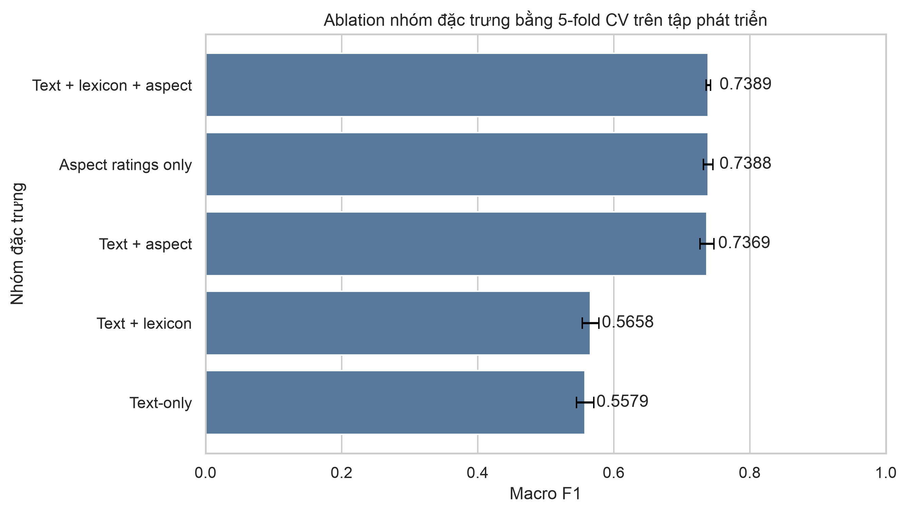
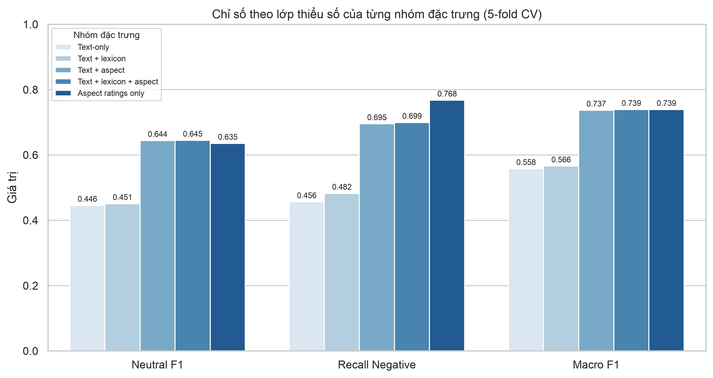

# Tổng quan dữ liệu, phân tích khám phá và trích xuất đặc trưng

## 2.1. Tổng quan bộ dữ liệu ITviec Reviews

Bộ dữ liệu sau tiền xử lý tại `data/processed/reviews_cleaned.xlsx` gồm **8.417 review** và **23 trường**, không có dòng trùng hoàn toàn. Cấu trúc dữ liệu bao gồm sáu nhóm trường:

- Thông tin định danh và doanh nghiệp: `id`, `Company Name`, `Cmt_day`.
- Nội dung review: `Title`, `What I liked`, `Suggestions for improvement`.
- Điểm tổng thể: `Rating` từ 1 đến 5 sao.
- Năm điểm khía cạnh: lương và phúc lợi, đào tạo, quản lý, văn hóa, văn phòng.
- Nội dung đã xử lý: `raw_review_text`, `clean_basic_text`, `clean_advance_text`.
- Đặc trưng từ điển cảm xúc: `pos_w`, `neg_w`, `pos_e`, `neg_e`, `total_we`, `sentiment_ratio`.

Nhãn mục tiêu `sentiment` nhận ba giá trị `Positive`, `Neutral`, `Negative`. Đây là **nhãn yếu suy ra từ điểm đánh giá** (rating-derived weak label) theo quy tắc từ 4 sao trở lên là Positive, 3 sao là Neutral, từ 2 sao trở xuống là Negative. Nhãn này không phải nhãn vàng do con người đọc nội dung và gán, và đặc điểm đó chi phối cách diễn giải toàn bộ kết quả trình bày phía sau.

Dữ liệu khuyết thiếu chỉ xuất hiện ở `What I liked` (1 dòng, 0,01%) và `Suggestions for improvement` (5 dòng, 0,06%). Các cột đã tiền xử lý và cột nhãn không có giá trị khuyết thiếu. Có 6 dòng thuộc ba nhóm `clean_advance_text` trùng nhau, trong đó một nhóm có cùng nội dung văn bản nhưng khác nhãn yếu. Trước khi chia dữ liệu huấn luyện, nhóm bất đồng nhãn bị loại toàn bộ và nhóm trùng cùng nhãn chỉ giữ lại một dòng, còn **8.413 dòng**.

## 2.2. Phân tích khám phá dữ liệu

### Phân bố số sao và nhãn cảm xúc

| Rating | Số review |
|---:|---:|
| 1 | 124 |
| 2 | 446 |
| 3 | 1.639 |
| 4 | 2.698 |
| 5 | 3.510 |

| Nhãn | Số review | Tỷ lệ |
|---|---:|---:|
| Positive | 6.208 | 73,76% |
| Neutral | 1.639 | 19,47% |
| Negative | 570 | 6,77% |

Lớp Positive chiếm gần ba phần tư dữ liệu và lớn gấp khoảng 10,9 lần lớp Negative. Mức mất cân bằng này khiến Accuracy không phải chỉ số đánh giá phù hợp, vì một bộ phân loại luôn dự đoán Positive đã đạt xấp xỉ 73,8% Accuracy mà không có giá trị sử dụng. Các thí nghiệm trong báo cáo do đó lấy **Macro F1** làm chỉ số chính và theo dõi thêm Recall của lớp Negative.

### Độ dài nội dung review

| Trường | Trung bình | Trung vị | Phân vị 95 | Phân vị 99 | Lớn nhất |
|---|---:|---:|---:|---:|---:|
| What I liked | 50,29 | 36 | 131 | 237,36 | 1.400 |
| Suggestions for improvement | 29,97 | 20 | 78 | 184 | 876 |

Phân bố độ dài lệch phải rõ rệt. Phần lớn review ngắn, nhưng tồn tại một số ngoại lệ rất dài. Biểu diễn TF-IDF phù hợp với dải độ dài biến thiên này vì sử dụng trọng số chuẩn hóa thay cho số lần xuất hiện tuyệt đối.

### Thống kê token rỗng và review quá ngắn

Chuỗi `clean_advance_text` sau tiền xử lý được kiểm tra để xác định có review nào bị mất toàn bộ nội dung hay không, vì tài liệu rỗng sẽ tạo vector TF-IDF toàn số 0 và trở thành nhiễu trong huấn luyện.

| Nhóm | Số review | Tỷ lệ |
|---|---:|---:|
| Chuỗi rỗng hoàn toàn | 0 | 0,00% |
| Dưới 3 token | 0 | 0,00% |
| Dưới 5 token | 0 | 0,00% |
| Dưới 10 token | 35 | 0,42% |

Trên 8.413 review dùng cho mô hình, số token trung bình là 35,95, trung vị 28, nhỏ nhất 5 và lớn nhất 511. Không tồn tại tài liệu rỗng hay quá ngắn tới mức vô nghĩa, nên không cần thêm bước lọc theo độ dài trước khi vector hóa.

### Quan hệ giữa điểm khía cạnh và cảm xúc tổng thể

Tương quan Spearman với `Rating`, theo thứ tự giảm dần:

| Khía cạnh | Tương quan Spearman |
|---|---:|
| Management cares about me | 0,7368 |
| Salary & benefits | 0,7343 |
| Culture & fun | 0,6566 |
| Training & learning | 0,6398 |
| Office & workspace | 0,5423 |

Điểm trung bình của mọi khía cạnh đều giảm theo thứ tự Positive, Neutral, Negative. Chênh lệch lớn nhất tập trung ở quản lý, lương và phúc lợi, văn hóa. Đây là các tín hiệu dự báo hữu ích. Tuy nhiên `Rating` tổng thể không được đưa vào ma trận đặc trưng, vì nhãn `sentiment` được tạo trực tiếp từ trường này và việc sử dụng nó sẽ gây rò rỉ nhãn.

### Phân bố theo doanh nghiệp

Dữ liệu bao phủ **180 công ty** trong giai đoạn 07/2016 đến 05/2025. Phân bố công ty không đồng đều. FPT Software có 2.014 review, chiếm 23,93%, trong khi 110 trên 180 công ty có dưới 20 review. Kết quả phân tích ở cấp công ty vì vậy cần hiển thị kèm số mẫu và chỉ nên diễn giải khi đạt ngưỡng tối thiểu.

### Chẩn đoán chất lượng nhãn yếu và từ điển cảm xúc

- Từ điển cảm xúc ở phiên bản đối sánh theo từ đơn chỉ có ít nhất một hit trên **12,26%** review. Sau khi chuyển sang thuật toán đối sánh cụm từ dài nhất (Greedy Longest Phrase Matching) và mở rộng từ điển, độ bao phủ đạt **99,54%**, với `total_we` trung bình tăng từ 0,16 lên 6,06 và `pos_w` tăng từ 0,08 lên 4,78.
- `pos_e` và `neg_e` bằng 0 trên toàn bộ 8.417 dòng ở cả hai phiên bản từ điển. Hai đặc trưng emoji do đó là hằng số và không mang thông tin phân biệt.
- Trường `Recommend?` bất đồng với nhãn yếu ở một tỷ lệ đáng kể: 41 review Negative vẫn được khuyến nghị, trong khi 411 review Neutral và 87 review Positive không được khuyến nghị.
- Những dấu hiệu trên không chứng minh nhãn yếu sai, nhưng cho thấy `Rating` không thể được mô tả như ground truth tuyệt đối.

## 3.1. Phương pháp trích xuất đặc trưng

### Thiết kế thí nghiệm

Sau khi loại văn bản trùng, dữ liệu được chia phân tầng thành **tập phát triển 80%** và **tập kiểm tra cuối 20%** với `random_state=2026`. Tập kiểm tra cuối được khóa và không dùng để tính bất kỳ chỉ số nào trong quá trình chọn đặc trưng. Mọi so sánh đều thực hiện bằng 5-fold Stratified Cross-Validation trên tập phát triển. Vectorizer và bộ chuẩn hóa được fit lại độc lập bên trong từng fold nhằm tránh rò rỉ thông tin từ phần dữ liệu kiểm định.

Bộ phân loại dùng chung cho mọi cấu hình đặc trưng là Logistic Regression với `class_weight='balanced'`, `max_iter=1000` và `random_state=2026`. Việc cố định bộ phân loại cho phép quy mọi chênh lệch quan sát được về khác biệt giữa các nhóm đặc trưng.

### Cấu hình TF-IDF

TF-IDF được fit trên `clean_advance_text` với `max_features=5000`, `min_df=2` và `sublinear_tf=True`. Cấu hình n-gram được lựa chọn bằng thực nghiệm:

| Cấu hình | Macro F1 trung bình | Độ lệch chuẩn |
|---|---:|---:|
| Unigram `(1, 1)` | 0,5396 | 0,0073 |
| Unigram + bigram `(1, 2)` | 0,5579 | 0,0127 |

Cấu hình unigram kết hợp bigram cao hơn 0,0183 Macro F1 và được chọn cho toàn bộ thí nghiệm phía sau.

### So sánh phương pháp vector hóa

Hai phương pháp biểu diễn văn bản được so sánh trên cùng bộ fold, cùng cấu hình từ vựng và cùng bộ phân loại:

| Phương pháp | Macro F1 | Neutral F1 | Recall Negative | Negative F1 | Accuracy |
|---|---:|---:|---:|---:|---:|
| **TF-IDF, sublinear TF** | **0,5579** | **0,4456** | **0,4563** | **0,3894** | 0,7158 |
| Bag-of-Words | 0,5418 | 0,4147 | 0,3773 | 0,3706 | **0,7177** |

TF-IDF cao hơn 0,0161 Macro F1 và cải thiện ở 4 trên 5 fold. Kết quả này minh họa rõ vì sao Accuracy không được chọn làm chỉ số quyết định: Bag-of-Words đạt Accuracy cao hơn (0,7177 so với 0,7158) nhưng Recall lớp Negative thấp hơn đáng kể (0,3773 so với 0,4563). Bag-of-Words đếm số lần xuất hiện tuyệt đối nên chịu ảnh hưởng mạnh từ các từ phổ biến của lớp đa số, trong khi trọng số nghịch đảo tần suất tài liệu của TF-IDF làm giảm ảnh hưởng đó. Toàn bộ thí nghiệm phía sau dùng TF-IDF.

### Ablation nhóm đặc trưng

Thí nghiệm ablation nhằm trả lời ba câu hỏi. Thứ nhất, mô hình học được bao nhiêu từ nội dung văn bản so với từ các điểm số có sẵn. Thứ hai, đặc trưng từ điển cảm xúc sau khi nâng độ bao phủ lên 99,54% có cải thiện kết quả hay không. Thứ ba, việc bổ sung năm điểm khía cạnh có cải thiện riêng hai lớp thiểu số Neutral và Negative hay không.

Năm nhóm đặc trưng được so sánh trên cùng bộ fold, cùng seed và cùng bộ phân loại:

| Nhóm đặc trưng | Macro F1 | Neutral F1 | Recall Negative | Negative F1 | Accuracy |
|---|---:|---:|---:|---:|---:|
| Text-only | 0,5579 | 0,4456 | 0,4563 | 0,3894 | 0,7158 |
| Text + lexicon | 0,5658 | 0,4508 | 0,4824 | 0,4049 | 0,7204 |
| Text + aspect | 0,7369 | 0,6441 | 0,6952 | 0,6485 | 0,8373 |
| **Text + lexicon + aspect** | **0,7389** | **0,6448** | 0,6995 | **0,6526** | **0,8389** |
| Aspect ratings only | 0,7388 | 0,6353 | **0,7676** | 0,6649 | 0,8337 |

Trường `clean_advance_text` không thay đổi sau khi cập nhật thuật toán từ điển, giống hệt trên toàn bộ 8.417 dòng. Nhờ vậy cấu hình Text-only tái lập đúng giá trị 0,5579 của thí nghiệm n-gram, xác nhận hai bảng số liệu so sánh trực tiếp được với nhau.

### Kiểm định theo cặp fold

Chênh lệch trung bình giữa các nhóm đặc trưng không đủ để kết luận, vì độ lệch chuẩn giữa các fold nằm trong khoảng 0,007 đến 0,015 và có thể lớn hơn chính chênh lệch cần đo. Do các nhóm đặc trưng dùng chung fold và seed, chênh lệch được tính theo từng cặp fold tương ứng:

| So với Text-only | Macro F1 delta | Số fold cải thiện | Delta nhỏ nhất |
|---|---:|---:|---:|
| Text + lexicon | +0,0079 | 3/5 | −0,0021 |
| Text + aspect | +0,1789 | 5/5 | +0,1635 |
| Text + lexicon + aspect | +0,1809 | 5/5 | +0,1631 |
| Aspect ratings only | +0,1808 | 5/5 | +0,1640 |

### Kết quả đối với đặc trưng từ điển cảm xúc

Việc nâng độ bao phủ từ điển đảo chiều đóng góp của nhóm đặc trưng này. Ở phiên bản đối sánh từ đơn, cấu hình Text + lexicon đạt 0,5556 Macro F1, thấp hơn Text-only. Ở phiên bản đối sánh cụm từ, cấu hình này đạt 0,5658, cao hơn Text-only.

Mức cải thiện tuy dương nhưng chỉ đạt +0,0079 Macro F1 và chỉ xuất hiện ở 3 trên 5 fold, với fold xấu nhất giảm 0,0021. Biên độ này nằm trong dao động giữa các fold, nên chưa đủ bằng chứng thống kê để khẳng định đặc trưng từ điển cải thiện mô hình khi đứng một mình. Việc khẳng định mức tăng này đòi hỏi lặp lại cross-validation với nhiều seed khác nhau.

Ở mức đặc trưng đơn lẻ, `sentiment_ratio` sau khi cập nhật đã phân tách ba lớp theo đúng thứ tự kỳ vọng, với giá trị trung bình 0,090 ở lớp Negative, 0,428 ở lớp Neutral và 0,679 ở lớp Positive. Ở phiên bản trước, đặc trưng này gần như phẳng giữa ba lớp.

### Kết quả đối với điểm khía cạnh

Việc bổ sung năm điểm khía cạnh cải thiện cả ba chỉ số quan tâm và cải thiện ở toàn bộ 5 trên 5 fold:

- Neutral F1 tăng từ 0,4456 lên 0,6448, tương ứng +0,1992.
- Recall lớp Negative tăng từ 0,4563 lên 0,6995, tương ứng +0,2432.
- Macro F1 tăng từ 0,5579 lên 0,7389, tương ứng +0,1809.

Cấu hình Text + lexicon + aspect đạt giá trị cao nhất ở Macro F1, Neutral F1, Negative F1 và Accuracy, nên được chọn làm cấu hình đặc trưng đầy đủ. Một quan sát đáng chú ý là cấu hình Aspect ratings only đạt Recall Negative cao nhất (0,7676) nhưng Neutral F1 lại thấp hơn cấu hình có văn bản (0,6353 so với 0,6448). Điều này cho thấy biểu diễn văn bản vẫn đóng góp thông tin riêng cho việc phân tách lớp Neutral, và mô hình đầy đủ không đơn thuần đọc lại thang điểm khía cạnh.

Năm cột khía cạnh không có giá trị khuyết thiếu trên toàn bộ dữ liệu, nên bước thay thế giá trị khuyết bằng 0 trong `FeatureExtractor._prepare_numeric` không kích hoạt và không tạo ra giá trị nằm ngoài thang 1 đến 5. Hai cột `pos_e` và `neg_e` là hằng số 0 như đã nêu ở mục chẩn đoán, nên trong 10 cột số của cấu hình đầy đủ chỉ có 8 cột thực sự mang thông tin.

### Giới hạn của cấu hình chứa điểm khía cạnh

Mức cải thiện lớn của nhóm đặc trưng khía cạnh cần được diễn giải thận trọng vì hai lý do.

Thứ nhất, nhãn `sentiment` được suy ra trực tiếp từ `Rating`, trong khi năm điểm khía cạnh có tương quan Spearman từ 0,5423 đến 0,7368 với chính `Rating`. Phần lớn mức tăng do đó phản ánh việc mô hình khôi phục lại thang điểm đã sinh ra nhãn, chứ không phản ánh năng lực hiểu ngôn ngữ tốt hơn. Cấu hình Aspect ratings only đạt Macro F1 0,7388 mà không dùng một từ nào trong review là bằng chứng trực tiếp cho nhận định này.

Thứ hai, cấu hình chứa điểm khía cạnh đòi hỏi đủ năm điểm số tại thời điểm dự đoán. Kịch bản sử dụng trong đó hệ thống chỉ nhận một đoạn văn bản tự do không đáp ứng được điều kiện này.

Từ hai giới hạn trên, báo cáo giữ song song hai bộ đặc trưng. Cấu hình chứa điểm khía cạnh phục vụ phần thực nghiệm và bảng so sánh mô hình, trong đó cần nêu rõ giới hạn vừa trình bày. Cấu hình chỉ dùng văn bản phục vụ kịch bản dự đoán từ văn bản tự do. Hai bộ dùng chung phép chia dữ liệu và seed nên số liệu đặt cạnh nhau được. Đối với kịch bản chỉ có văn bản, hướng cải thiện hợp lệ là bổ sung đặc trưng từ điển, vì các đặc trưng này tính được trực tiếp từ nội dung người dùng nhập vào.

### Ma trận đặc trưng

| Cấu hình | Tập phát triển | Tập kiểm tra cuối |
|---|---|---|
| Chỉ văn bản | 6.730 × 5.000 | 1.683 × 5.000 |
| Văn bản + từ điển + khía cạnh | 6.730 × 5.010 | 1.683 × 5.010 |

Phân bố nhãn trên tập phát triển gồm 4.964 Positive, 1.310 Neutral và 456 Negative. Phân bố chi tiết và các chỉ số mô hình trên tập kiểm tra cuối không được báo cáo ở giai đoạn chọn đặc trưng, ngoài việc kiểm tra tính nhất quán kỹ thuật của ma trận.

### Xử lý mất cân bằng lớp

Với tỷ lệ lớp Positive gấp 10,9 lần lớp Negative, ba chiến lược được so sánh thực nghiệm trên cùng giao thức. SMOTE chỉ áp dụng trên phần huấn luyện của từng fold, không bao giờ trên phần kiểm định, nhằm tránh việc mẫu tổng hợp rò rỉ sang dữ liệu đánh giá.

| Chiến lược | Macro F1 | Neutral F1 | Recall Negative | Negative F1 | Accuracy |
|---|---:|---:|---:|---:|---:|
| Không xử lý | 0,4622 | 0,3508 | 0,0921 | 0,1646 | **0,7676** |
| `class_weight='balanced'` | 0,5579 | **0,4456** | **0,4563** | 0,3894 | 0,7158 |
| SMOTE | **0,5600** | 0,4340 | 0,4410 | **0,3989** | 0,7263 |

Cấu hình không xử lý mất cân bằng cho kết quả có ý nghĩa quan trọng về mặt phương pháp. Nó đạt **Accuracy cao nhất trong cả ba** (0,7676) nhưng Recall lớp Negative chỉ 0,0921, tức là bỏ sót hơn 90% review tiêu cực. Đây là bằng chứng trực tiếp cho nhận định ở mục 2.2 rằng Accuracy không phải chỉ số đánh giá phù hợp với bộ dữ liệu này.

Giữa hai chiến lược còn lại, SMOTE cao hơn 0,0020 Macro F1 nhưng chỉ cải thiện ở 2 trên 5 fold, tức là không phân biệt được với `class_weight='balanced'` ở mức nhiễu hiện tại. Trong khi đó `class_weight='balanced'` cho Recall lớp Negative cao hơn (0,4563 so với 0,4410), không sinh thêm mẫu tổng hợp, và giữ nguyên kích thước ma trận huấn luyện. Với biểu diễn TF-IDF thưa và số chiều cao, các vector do SMOTE nội suy cũng khó diễn giải về mặt ngữ nghĩa vì không tương ứng với văn bản có thật.

Từ các căn cứ trên, `class_weight='balanced'` được chọn làm chiến lược mặc định cho mọi thí nghiệm trong báo cáo. SMOTE được giữ lại trong `src/features.py` như một lựa chọn thay thế cho các mô hình không hỗ trợ trọng số lớp.

## Phụ lục: tài nguyên tái lập kết quả

| Tệp | Nội dung |
|---|---|
| `notebooks/01_data_exploration_eda.ipynb` | Notebook phân tích khám phá và trích xuất đặc trưng |
| `src/features.py` | Pipeline đặc trưng, xử lý văn bản trùng, chia phân tầng, SMOTE, ràng buộc artifact |
| `scripts/run_aspect_hybrid_ablation.py` | Thí nghiệm ablation kèm chỉ số từng lớp và kiểm định theo cặp fold |
| `scripts/build_hybrid_artifacts.py` | Sinh artifact cho cấu hình văn bản kết hợp đặc trưng số |
| `models/text_tfidf_vectorizer.joblib` | Vectorizer của cấu hình chỉ văn bản |
| `models/text_feature_extractor.joblib` | Bộ trích xuất của cấu hình chỉ văn bản |
| `models/train_test_features.joblib` | Ma trận, nhãn, chỉ số dòng và metadata của cấu hình chỉ văn bản |
| `models/hybrid_feature_extractor.joblib` | Bộ trích xuất TF-IDF kết hợp 5 đặc trưng từ điển và 5 điểm khía cạnh |
| `models/hybrid_train_test_features.joblib` | Ma trận 6.730 × 5.010 và 1.683 × 5.010, cùng phép chia với cấu hình chỉ văn bản |
| `models/artifact_manifest.json`, `models/hybrid_artifact_manifest.json` | Phiên bản môi trường, hash dữ liệu, Git SHA, checksum artifact |
| `reports/aspect_hybrid_ablation.csv` | Kết quả ablation tổng hợp |
| `reports/aspect_hybrid_ablation_per_fold.csv` | Kết quả ablation chi tiết theo từng fold |
| `scripts/plot_ablation_figures.py` | Sinh lại hai biểu đồ ablation từ kết quả đã lưu |
| `scripts/run_tv2_feature_experiments.py` | Thống kê token rỗng, so sánh TF-IDF với Bag-of-Words, so sánh chiến lược cân bằng lớp |
| `reports/tv2_empty_token_stats.csv` | Thống kê token rỗng và review ngắn |
| `reports/tv2_vectorizer_comparison.csv` | Kết quả so sánh TF-IDF với Bag-of-Words |
| `reports/tv2_balancing_comparison.csv` | Kết quả so sánh chiến lược cân bằng lớp |
| `data/annotation/sentiment_audit_blind.csv`, `sentiment_audit_key.csv` | Bộ 300 review phục vụ gán nhãn thủ công độc lập |
| `requirements.lock` | Môi trường Python 3.11 tái lập được |
| `reports/figures/` | Mười biểu đồ phân tích, độ phân giải 300 dpi |
