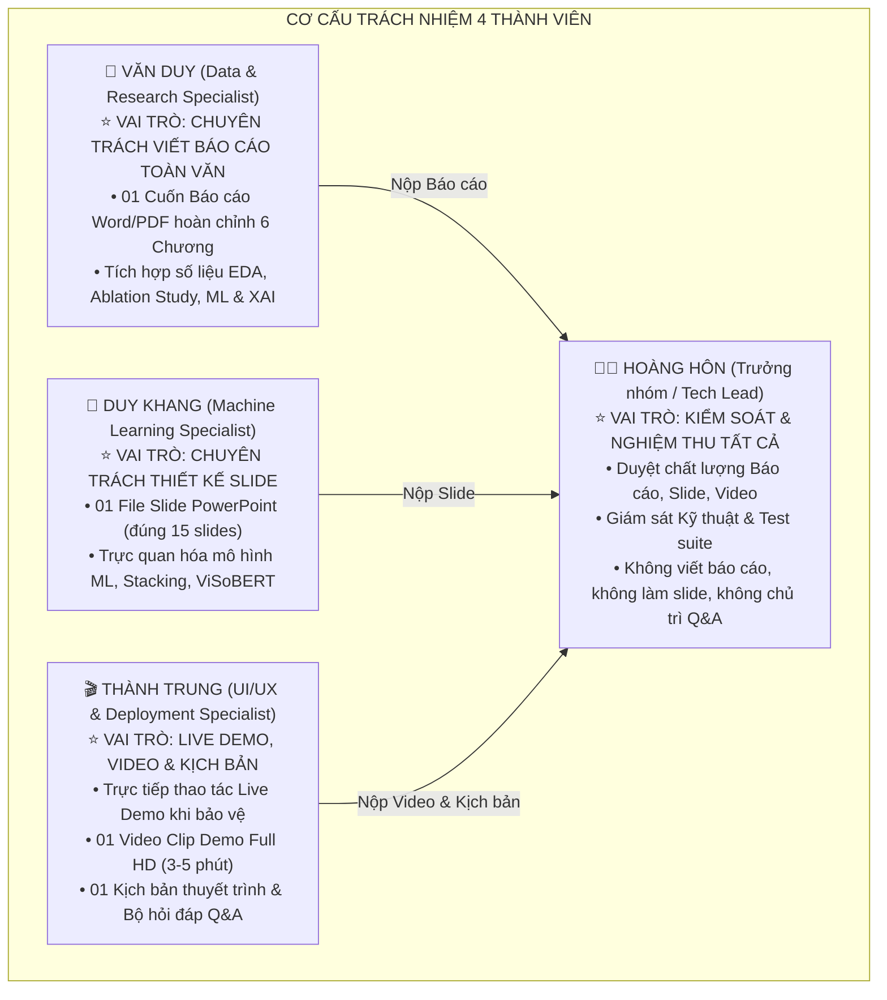

# 🏆 KẾ HOẠCH HOÀN THIỆN ĐỒ ÁN NLP: PHÂN TÍCH CẢM XÚC ĐÁNH GIÁ ITVIEC
> **Giai đoạn**: Nước rút hoàn thiện, đóng gói đồ án & chuẩn bị bảo vệ trước Hội đồng  
> **Cập nhật lần cuối**: 09/09/2026  
> **Repository**: [https://github.com/mrkiss-it/NLP-Sentiment-Analysis-ITviec](https://github.com/mrkiss-it/NLP-Sentiment-Analysis-ITviec)

---

## 📌 I. NGUYÊN TẮC PHÂN CÔNG: CHUYÊN MÔN HÓA 100% (SINGLE OWNERSHIP)

Mỗi thành viên sở hữu trọn gói đúng **01 sản phẩm đầu ra độc lập**, chịu trách nhiệm từ A đến Z, không chia nhỏ chương mục gây chồng chéo. Trưởng nhóm giữ vai trò **Kiểm soát viên Tối cao (Quality Gatekeeper & Auditor)** kiểm tra chất lượng trước khi nộp.



---

## 👥 II. BẢNG PHÂN CÔNG NHIỆM VỤ CHI TIẾT TỪNG THÀNH VIÊN

---

### 1. 🧑‍💻 HOÀNG HÔN (TRƯỞNG NHÓM)
* **Vị trí**: `Lead Reviewer, Quality Gatekeeper & Technical Governance`
* **Cam kết phạm vi công việc**:
  - ❌ **Không viết báo cáo**
  - ❌ **Không làm slide thuyết trình**
  - ❌ **Không chủ trì phần phản biện Q&A**
  - ✅ **Là người kiểm tra và duyệt nghiệm thu toàn bộ sản phẩm của nhóm trước khi nộp**

#### Nhiệm vụ cụ thể:
1. **Kiểm tra Báo cáo toàn văn**:
   - Đọc soát toàn bộ cuốn báo cáo do Văn Duy nộp.
   - Bắt lỗi chính tả, kiểm tra tính chuẩn xác của các con số (8.417 review, CV Macro F1 Stacking 0.5619, Final test 0.5475, ViSoBERT GPU 0.4036).
   - Yêu cầu sửa đổi nếu chưa đạt format chuẩn khoa học.
2. **Kiểm tra Bộ Slide thuyết trình**:
   - Duyệt file Slide PowerPoint do Duy Khang nộp.
   - Đảm bảo đúng phong cách Dark-tech, bố cục thoáng, không chứa đoạn văn dài, đủ các biểu đồ 300 DPI từ `reports/figures/`.
3. **Kiểm tra Video Demo & Kịch bản**:
   - Xem và duyệt video clip do Thành Trung quay (đảm bảo rõ nét Full HD, âm thanh rõ, test đúng câu phủ định khó).
   - Duyệt kịch bản phân vai và bộ câu hỏi phản biện.
4. **Giám sát Kỹ thuật Hướng 2**:
   - Giám sát việc tích hợp mô hình song song `Text + Lexicon` (5.005 cột) và đảm bảo `pytest tests/` đạt **43/43 tests pass 100%**.
5. **Duyệt xuất xưởng (Final Sign-off)**:
   - Là người bấm nút nộp bài cuối cùng đại diện cho nhóm.

---

### 2. 📄 VĂN DUY (TV2)
* **Vị trí**: `Lead Report Writer (Chuyên trách Viết Báo cáo Đồ án)`
* **Sản phẩm bàn giao**: **01 File Báo cáo toàn văn hoàn chỉnh (`.docx` và `.pdf`)** chuẩn mẫu 6 Chương theo đề cương `reports/final_report_outline.md` (khoảng 35 – 45 trang).

#### Cấu trúc Báo cáo chi tiết Văn Duy chịu trách nhiệm:
* **Phần mở đầu**: Lời cam đoan, Lời cảm ơn, Mục lục, Danh mục bảng biểu và hình vẽ.
* **Chương 1: Tổng quan và Đặt vấn đề**: Bối cảnh phân tích cảm xúc ngành IT, mục tiêu phân loại 3 lớp, đối tượng nghiên cứu.
* **Chương 2: Dữ liệu và Tiền xử lý**:
  - Cấu trúc 8.417 review ITviec, phân tích phân bố sao rating (73.8% Positive, 19.5% Neutral, 6.8% Negative).
  - Pipeline tiền xử lý 2 tầng (`clean_basic_text` & `clean_advance_text`).
  - Thuật toán nhận diện phạm vi phủ định (**Negation Scope Detection**) và đối sánh từ điển tham lam (**Greedy Matching 99.75%**).
* **Chương 3: Biểu diễn Văn bản & Mô hình hóa**:
  - Trích xuất TF-IDF unigram+bigram 5.000 chiều.
  - **Điểm nhấn học thuật (Ablation Study)**: Trình bày chi tiết bảng so sánh 5 cấu hình đặc trưng của TV2, chứng minh `Text + Lexicon` đạt **Macro F1 0.5658** (tăng F1 và tăng Recall Negative lên 48.24%). Phân tích lý do từ chối dùng Aspect Ratings để tránh data shortcut.
  - Thiết kế 4 mô hình ML cơ sở (NB, LR, SVM, RF), kỹ thuật `class_weight='balanced'` và Stacking Ensemble.
* **Chương 4: Kết quả Thực nghiệm & Đánh giá**:
  - Bảng tổng hợp đối sánh hiệu năng các mô hình trên tập CV và Final Test khóa.
  - Ma trận nhầm lẫn (Confusion Matrix) và phân tích bẫy Accuracy trên dữ liệu mất cân bằng.
  - **Phân tích lỗi sai định tính (Qualitative Error Analysis)**: Phân tích case study câu phủ định khó trước và sau khi có Hybrid Decision Gate.
* **Chương 5: Phân tích Insight Doanh nghiệp & Ứng dụng Web**:
  - Trực quan hóa đám mây từ khóa (WordCloud) theo công ty IT (FPT, VNG, Shopee...).
  - Mô tả kiến trúc Web Demo Streamlit giao diện Dark mode và tính năng giải thích XAI.
* **Chương 6: Kết luận & Hướng phát triển**:
  - Tóm tắt đóng góp của đồ án, hạn chế và hướng mở rộng sang bài toán ABSA.

---

### 3. 🎨 DUY KHANG (TV3)
* **Vị trí**: `Lead Presentation Designer (Chuyên trách Thiết kế Slide)`
* **Sản phẩm bàn giao**: **01 File Slide Trình chiếu PowerPoint (`.pptx`)** gồm **đúng 15 slide** thiết kế chuẩn phong cách Dark-tech công nghệ, tinh gọn và cô đọng cho thời lượng bảo vệ 15–18 phút.

#### Cấu trúc 15 Slide Duy Khang chịu trách nhiệm:
1. **Slide 1: Trang bìa**: Tên đề tài, Giảng viên hướng dẫn: Thầy Đặng Văn Thìn, Nhóm 4 sinh viên thực hiện.
2. **Slide 2: Đặt vấn đề & Thách thức dữ liệu ITviec**: Bối cảnh phân tích cảm xúc tuyển dụng ngành IT; Thách thức mất cân bằng nghiêm trọng (11:1), teencode, từ lóng kỹ thuật Anh - Việt, cấu trúc đối lập khen/chê đan xen.
3. **Slide 3: Sơ đồ kiến trúc tổng thể (End-to-End Pipeline)**: Luồng dữ liệu hoàn chỉnh từ Thu thập $\to$ Tiền xử lý 2 tầng $\to$ Trích xuất đặc trưng $\to$ Mô hình hóa ML/DL $\to$ Hybrid Decision Gate $\to$ Ứng dụng Web & XAI.
4. **Slide 4: Tiền xử lý dữ liệu chuyên sâu & Thuật toán Negation Scope**: Pipeline tiền xử lý 2 tầng độc lập (`clean_advance_text` cho ML vs `clean_text_for_transformer` bảo toàn cú pháp cho Deep Learning); Thuật toán quét cửa sổ phủ định (**Negation Scope Detection**) đảo ngược cực tính từ ngữ.
5. **Slide 5: Khám phá dữ liệu EDA (Exploratory Data Analysis)**: Phân bố 8.417 review theo nhãn sao (73.8% Tích cực, 19.5% Trung tính, 6.8% Tiêu cực); Độ dài văn bản, độ trễ thời gian và tương quan giữa các khía cạnh đánh giá.
6. **Slide 6: Thí nghiệm đối chứng đặc trưng (Ablation Study)**: Biểu đồ chứng minh bộ đặc trưng mở rộng `Text + Lexicon` (5.005 chiều) vượt trội `Text-only` (Macro F1 tăng từ 0.5475 lên 0.5658, Recall lớp Tiêu cực tăng lên 48.24%); Lập luận khoa học vì sao loại bỏ Aspect Ratings để ngăn chặn hiện tượng Data Shortcut.
7. **Slide 7: Thiết kế 4 mô hình ML cơ sở & Kỹ thuật Stacking Ensemble**: Đánh giá 4 thuật toán nền tảng (Naive Bayes, Logistic Regression, Linear SVM, Random Forest) với `class_weight='balanced'`; Kiến trúc Stacking Ensemble kết hợp đa mô hình thông qua meta-classifier Logistic Regression.
8. **Slide 8: Thử nghiệm Deep Learning ViSoBERT trên GPU Runpod**: Quá trình huấn luyện mô hình Transformer ViSoBERT trên hạ tầng GPU Runpod (Macro F1: 0.4036); Phân tích hiện tượng xung đột giữa tiền xử lý văn bản cổ điển (Over-cleaning) và cơ chế Tokenizer/Self-Attention của mô hình ngôn ngữ lớn.
9. **Slide 9: Bảng so sánh hiệu năng tổng thể & Ma trận nhầm lẫn**: Bảng Leaderboard 7 mô hình (Cross-Validation vs Final Test); Trực quan hóa ma trận nhầm lẫn (Confusion Matrix) và vạch trần "bẫy Accuracy" trên tập dữ liệu mất cân bằng nghiêm trọng.
10. **Slide 10: Phân tích lỗi sai định tính & Cổng quyết định Hybrid Decision Gate**: Phân tích chuyên sâu các case study dự đoán sai điển hình (câu phủ định phức tạp, đánh giá trung tính mập mờ); Cơ chế kích hoạt Cổng lai (Hybrid Gate) kết hợp linh hoạt giữa Machine Learning và Tri thức từ điển miền IT.
11. **Slide 11: Khám phá Insight cảm xúc ngành công nghệ thông tin**: Trực quan hóa đám mây từ khóa (WordCloud) theo sắc thái cảm xúc; Khám phá thực trạng văn hóa làm việc, chế độ OT, đãi ngộ và lộ trình phát triển tại các tập đoàn công nghệ hàng đầu (FPT, VNG, NashTech...).
12. **Slide 12: Giới thiệu Ứng dụng Web Demo Streamlit**: Giao diện Dark-tech công nghệ cao với 4 phân hệ chức năng: Trang Tổng quan dự án, Khám phá dữ liệu, Phân tích doanh nghiệp, và Dự đoán cảm xúc thời gian thực (hỗ trợ chuyển đổi song song 2 mô hình).
13. **Slide 13: Kiến trúc Explainable AI (XAI) thời gian thực**: Trực quan hóa trọng số đóng góp của từng từ ngữ (TF-IDF Feature Importance); Bóc tách trực tiếp các cụm từ mang sắc thái Tích cực/Tiêu cực giúp người dùng hiểu rõ lý do mô hình ra quyết định.
14. **Slide 14: Đánh giá thực nghiệm, Bài học & Hạn chế**: Tổng kết các thành tựu kỹ thuật đã đạt được; Những bài học kinh nghiệm về xử lý dữ liệu mất cân bằng và ngữ liệu tiếng Việt; Các giới hạn hiện tại của mô hình.
15. **Slide 15: Kết luận, Hướng phát triển tương lai & Lời cảm ơn**: Định hướng mở rộng sang bài toán Phân tích cảm xúc theo khía cạnh (ABSA) và Tinh chỉnh toàn phần ViSoBERT; Lời cảm ơn chân thành đến GVHD Thầy Đặng Văn Thìn cùng Hội đồng đánh giá và sẵn sàng bước vào phần Q&A.

---

### 4. 🎬 THÀNH TRUNG (TV4)
* **Vị trí**: `Live Demo Operator, Video Producer & Script Writer`
* **Sản phẩm bàn giao**:
  1. **01 Video Clip Demo Full HD (3 – 5 phút)** có thuyết minh rõ ràng.
  2. **Trực tiếp thao tác Live Demo** trên máy chiếu khi Hội đồng yêu cầu.
  3. **01 File Kịch bản thuyết trình (Script)** phân vai cho cả nhóm (15–18 phút).
  4. **01 Bộ tài liệu câu hỏi phản biện & câu trả lời mẫu (Q&A Defense Guide)**.

#### Nhiệm vụ cụ thể của Thành Trung:
1. **Quay Video Clip Demo (Full HD 1080p, 3–5 phút)**:
   - *Phần 1 (0:00 - 1:00)*: Trang Overview & Luồng kiến trúc.
   - *Phần 2 (1:00 - 2:30)*: Trang Company Insights, chọn công ty FPT/VNG, xem WordCloud.
   - *Phần 3 (2:30 - 4:30)*: Trang Real-time Prediction. Test câu khó: *"Môi trường làm việc không được thân thiện, đồng nghiệp không hỗ trợ và ít cơ hội học hỏi"* $\to$ hiển thị nhãn **Tiêu cực (71.1%)**, bóc tách XAI 3 cụm từ, và gạt nút so sánh giữa mô hình Text-only và Text + Lexicon.
   - *Phần 4 (4:30 - 5:00)*: Kết thúc, khẳng định app chạy ổn định.
2. **Soạn Kịch bản Thuyết trình (Presentation Script)**:
   - Phân vai lời thoại chi tiết theo từng slide cho Duy, Khang, Trung (căn chuẩn 15-18 phút).
3. **Soạn Bộ câu hỏi phản biện (Q&A Guide)**:
   - Soạn sẵn 10 câu hỏi hóc búa của Hội đồng (Data Leakage, Shortcut learning, Imbalance, ViSoBERT zero-shot vs Stacking, XAI) kèm câu trả lời mẫu để Khang, Duy, Trung học thuộc và tự trả lời khi thầy cô hỏi.

---

## 🛠️ III. LỘ TRÌNH KỸ THUẬT HƯỚNG 2 (TEXT + LEXICON SONG SONG)

Để phục vụ việc so sánh trong Báo cáo của Duy, Slide của Khang và Demo của Trung:

```text
Pipeline Hiện tại (Mô hình 1):
  Văn bản -> TF-IDF (5.000 chiều) -> Stacking Classifier (best_sentiment_model.joblib)

Pipeline Mở rộng Hướng 2 (Mô hình 2):
  Văn bản -> [TF-IDF (5.000 chiều) || MinMaxScaler(5 Lexicon Features)] (5.005 chiều) 
          -> Stacking / Logistic Regression (best_text_lexicon_model.joblib)

Bộ chọn trên Streamlit UI:
  Radio: [● Mô hình 1: Text-only (5.000)  |  ○ Mô hình 2: Text + Lexicon (5.005)]
```

* **Ưu điểm**:
  - Không phá vỡ bất kỳ code cũ nào của TV3.
  - Giữ vững 43 unit tests pass 100%.
  - Giúp Trung có thêm tính năng "ăn điểm" khi quay video và live demo.

---

## 📅 IV. LỊCH TRÌNH 5 NGÀY TRIỂN KHAI & DUYỆT BÀI

| Ngày | Việc của Trưởng nhóm (Hoàng Hôn) | Việc của Văn Duy (Báo cáo) | Việc của Duy Khang (Slide) | Việc của Thành Trung (Demo & Video) |
| :---: | :--- | :--- | :--- | :--- |
| **Ngày 1** | **Hoàn thành Hướng 2**, đóng gói model `Text + Lexicon`, update Streamlit | Đọc kỹ outline, nhận số liệu bảng biểu | Chọn template Dark-tech, lấy ảnh biểu đồ | Lập kịch bản phân vai 15 phút |
| **Ngày 2** | Kiểm tra tiến độ sơ bộ của 3 bạn | **Viết xong Chương 1, 2, 3** | **Thiết kế xong Slide 1 $\to$ 8** | Viết xong bản thảo kịch bản lời thoại |
| **Ngày 3** | Nhắc nhở nộp bản thảo đầu tiên | **Viết xong Chương 4, 5, 6**; gom thành bản thảo Word | **Thiết kế xong Slide 9 $\to$ 15** | **Quay xong Video Demo Full HD**; soạn xong bộ Q&A |
| **Ngày 4** | 🔍 **KIỂM TRA & DUYỆT TẤT CẢ**: Soát lỗi Báo cáo, duyệt Slide, duyệt Video | Sửa lỗi báo cáo theo yêu cầu của Hoàng Hôn; xuất bản PDF | Sửa slide theo yêu cầu của Hoàng Hôn; xuất file PPTX | Cắt ghép video hoàn chỉnh; phát kịch bản cho cả nhóm |
| **Ngày 5** | 🎯 **TỔNG DUYỆT (REHEARSAL)**: Chạy thử thuyết trình 2 lần bấm giờ; Trung thao tác Live Demo |  |  |  |

---

## ✅ V. BẢNG TIÊU CHÍ NGHIỆM THU DÀNH RIÊNG CHO HOÀNG HÔN (QA CHECKLIST)

Khi 3 bạn nộp bài vào Ngày 4, Hoàng Hôn chỉ cần mở checklist này ra đối chiếu:

### 1. Báo cáo (Văn Duy nộp):
- [ ] Đủ 6 Chương, đúng font Times New Roman, dãn dòng 1.3 - 1.5, lề chuẩn (trái 3cm, còn lại 2cm).
- [ ] Số liệu chính xác: 8.417 mẫu; Stacking CV 0.5619, Final Test 0.5475; ViSoBERT 0.4036; Ablation Text+Lexicon 0.5658.
- [ ] Có đầy đủ hình ảnh biểu đồ 300 DPI từ `reports/figures/`.

### 2. Slide (Duy Khang nộp):
- [ ] Đúng 15 slide, phong cách Dark-tech, chữ to rõ ràng, không có đoạn văn dài.
- [ ] Đủ các mục từ Đặt vấn đề $\to$ Tiền xử lý $\to$ EDA & Ablation $\to$ Model ML/DL $\to$ Insights $\to$ Demo $\to$ Kết luận.

### 3. Video Demo & Kịch bản (Thành Trung nộp):
- [ ] Video clip Full HD 1080p, độ dài 3 – 5 phút, âm thanh thuyết minh rõ ràng.
- [ ] Video demo test đúng câu khó: *"Môi trường làm việc không được thân thiện, đồng nghiệp không hỗ trợ và ít cơ hội học hỏi"* $\to$ hiển thị **Tiêu cực (71.1%)** và bóc tách XAI.
- [ ] Kịch bản nói phân vai rõ ràng, tổng thời gian 15 – 18 phút.
- [ ] Bộ câu hỏi Q&A có đủ câu trả lời mẫu cho các câu hỏi xoáy của Thầy cô.

---
*Kế hoạch này được lưu chính thức tại `reports/ke_hoach_hoan_thien_do_an.md` để cả nhóm cùng theo dõi.*
