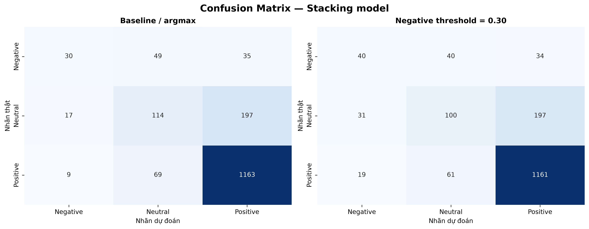

# Đánh giá mô hình và phân tích lỗi

## Phạm vi

- Mô hình: `models/best_sentiment_model.joblib` — StackingClassifier do TV3 bàn giao.
- Đặc trưng: TF-IDF text-only, 5.000 chiều từ `text_feature_extractor.joblib`.
- Tập đánh giá khóa: 1.683 mẫu final test, gồm 114 Negative, 328 Neutral và 1.241 Positive.
- Chính sách triển khai theo yêu cầu nhóm: nếu `P(Negative) >= 0,30` thì ưu tiên Negative; các trường hợp khác giữ dự đoán mặc định.
- Không huấn luyện lại hoặc thay đổi trọng số mô hình.

Notebook tái lập toàn bộ kết quả: `notebooks/06_model_evaluation_error_analysis.ipynb`.

## Kết quả chính

| Phương án | Accuracy | Macro F1 | Negative Precision | Negative Recall | Negative F1 | Số dự đoán Negative |
|---|---:|---:|---:|---:|---:|---:|
| Baseline / argmax | 77,66% | 0,5475 | 53,57% | 26,32% | 0,3529 | 56 |
| Negative threshold 0,30 | 77,30% | 0,5507 | 44,44% | 35,09% | 0,3922 | 90 |

Ngưỡng 0,30 giúp nhận đúng thêm 10 review Negative (từ 30 lên 40 trên tổng 114), tăng Recall 8,77 điểm phần trăm. Đổi lại, số false positive Negative tăng từ 26 lên 50 và Precision giảm 9,13 điểm phần trăm. Accuracy giảm nhẹ 0,36 điểm phần trăm; Macro F1 tăng 0,0032.

Kết quả thực nghiệm **không xác nhận** dự kiến Recall Negative 55–60% tại ngưỡng 0,30. Trên artifact hiện tại, ngưỡng 0,18 đạt Recall 57,89%, Precision 37,93% và Macro F1 0,5545. Vì final test không được dùng để tối ưu siêu tham số, 0,18 chỉ là phân tích độ nhạy, chưa phải policy được chọn.

## Đọc Confusion Matrix

### Baseline

| Nhãn thật | Dự đoán Negative | Dự đoán Neutral | Dự đoán Positive |
|---|---:|---:|---:|
| Negative | 30 | 49 | 35 |
| Neutral | 17 | 114 | 197 |
| Positive | 9 | 69 | 1.163 |

- Lỗi lớn nhất của lớp Negative là bị đẩy sang Neutral: 49/114 mẫu.
- 35/114 mẫu Negative bị dự đoán Positive, thường là review vừa khen vừa chê hoặc chứa nhiều từ tích cực ở phần mở đầu.
- Neutral cũng khó nhận diện: 197/328 mẫu bị đẩy sang Positive, phù hợp với phân phối dữ liệu lệch mạnh về Positive.

### Policy Negative 0,30

| Nhãn thật | Dự đoán Negative | Dự đoán Neutral | Dự đoán Positive |
|---|---:|---:|---:|
| Negative | 40 | 40 | 34 |
| Neutral | 31 | 100 | 197 |
| Positive | 19 | 61 | 1.161 |

- Policy cứu được 10 mẫu Negative, chủ yếu từ nhóm trước đó bị dự đoán Neutral.
- False positive tăng 24 mẫu: thêm 14 Neutral và 10 Positive bị chuyển thành Negative.
- Số Neutral → Positive không đổi, vì policy chỉ ưu tiên Negative và không điều chỉnh ranh giới Neutral/Positive.

## Error Analysis từ dữ liệu thật

Notebook xuất toàn bộ lỗi tại `reports/evaluation/all_policy_errors.csv` và 15 mẫu đại diện tại `reports/evaluation/error_analysis_15_samples.csv`.

### 1. Review vừa khen vừa chê

Nhiều review 2 sao mở đầu bằng “môi trường năng động”, “sếp tâm lý”, “nhiều công nghệ mới”, sau đó mới nêu “OT quá nhiều”, “lương thấp”. Tín hiệu tích cực xuất hiện dày khiến model dự đoán Positive dù nhãn theo rating là Negative.

Ví dụ nguồn `2668` của FPT Software: phần đầu khen môi trường và quản lý, phần sau lặp lại OT và phàn nàn lương. Model cho `P(Negative)=0,28%`, nên threshold 0,30 không thể sửa lỗi này.

### 2. Phủ định và sắc thái đảo chiều

Các cụm “không được trả”, “không có định hướng”, “gần như không có OT” mang ý nghĩa khác nhau tùy đối tượng bị phủ định. TF-IDF không biểu diễn tốt quan hệ cú pháp nên có thể đánh đồng từ khóa “OT”, “không” với tín hiệu tiêu cực.

Ví dụ nguồn `1828` có rating 5 nhưng nhắc “tạch”, “OT nhiều” và “áp lực”; model cho `P(Negative)=78,86%`, dẫn đến Positive → Negative.

### 3. Nhãn yếu từ rating và nội dung không đồng nhất

Sentiment ground truth được suy ra từ rating. Một review 3 sao có thể chứa phàn nàn rất mạnh và hợp lý khi model đọc nội dung là Negative. Ngược lại, review 4–5 sao vẫn có phần góp ý tiêu cực dài.

Nguồn `8096` có rating 3 nhưng mô tả quản lý kém, văn hóa tệ, thiếu training và quy trình thiếu chuyên nghiệp. Dự đoán Negative có thể đúng về ngữ nghĩa văn bản dù khác weak label Neutral.

### 4. Từ lóng và ngữ cảnh ngành IT

Các từ `OT`, `fresher`, `outsourcing`, `task`, `project`, `production` không mang một cực cảm xúc cố định. Ý nghĩa phụ thuộc vào cụm xung quanh, ví dụ “OT có trả lương” khác hoàn toàn “OT không công”. Bag-of-ngrams vẫn khó bao phủ hết các tổ hợp hiếm.

### 5. Review dài và nhiều chủ đề

Một review có thể đồng thời nói về lương, quản lý, văn hóa, dự án và cơ sở vật chất. Nhãn ba lớp buộc model nén toàn bộ nội dung thành một kết luận duy nhất, làm mất sắc thái theo khía cạnh.

## Kết luận triển khai

- Web Demo đã dùng đúng pipeline `TextPreprocessor → TF-IDF.transform() → StackingClassifier.predict_proba()`.
- Policy 0,30 được áp dụng sau xác suất model và dùng chung mã với notebook để tránh lệch kết quả.
- Không thay đổi model artifact hoặc huấn luyện lại.
- Nên trình bày cả Recall và Precision Negative; không chỉ báo cáo Recall tăng.
- Nếu nhóm muốn chính thức dùng ngưỡng khoảng 0,18, cần chọn trên validation/OOF rồi đánh giá một lần trên test mới hoặc ghi rõ đây chỉ là sensitivity analysis trên final test.
