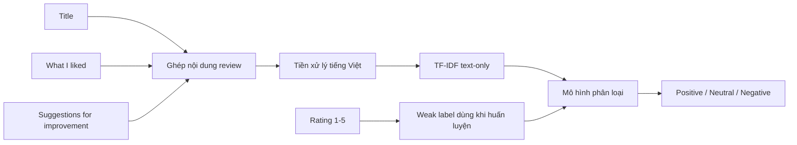
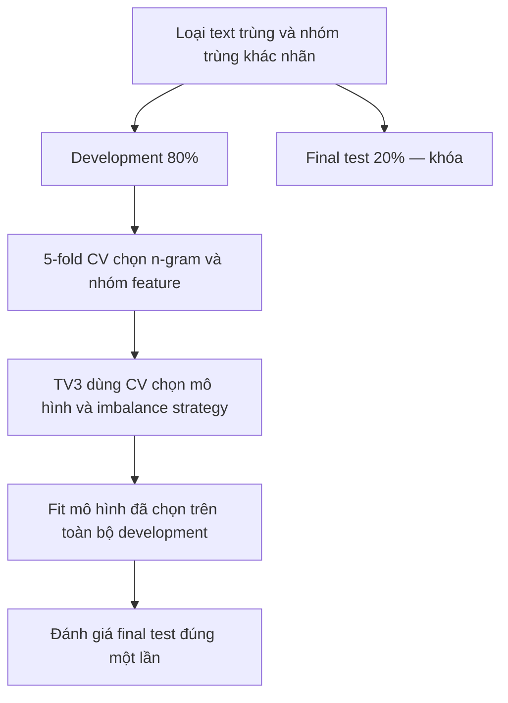

# Overview TV2 — EDA và Feature Engineering dễ hình dung

Tài liệu này giải thích phần việc TV2 bằng ngôn ngữ đơn giản để cả nhóm có thể trao đổi mà không cần đọc toàn bộ notebook.

## 1. Bài toán đang làm là gì?

Dự án nhận nội dung review ITviec và dự đoán một trong ba weak labels:

- **Positive:** Rating 4–5 sao.
- **Neutral:** Rating 3 sao.
- **Negative:** Rating 1–2 sao.

Các nhãn này được suy ra từ Rating nên là **rating-derived weak labels**, không phải ground truth do con người đọc nội dung rồi gán nhãn.



## 2. EDA dùng để làm gì?

EDA không phải bước “vẽ biểu đồ cho đẹp”. Nó trả lời các câu hỏi trước khi huấn luyện:

1. Dữ liệu có đủ và sạch không?
2. Ba lớp có cân bằng không?
3. Review dài/ngắn như thế nào?
4. Có công ty nào chi phối dữ liệu không?
5. Dữ liệu có thay đổi theo thời gian không?
6. Rating-derived weak labels có dấu hiệu bất nhất không?
7. Lexicon và emoji features có thực sự chứa tín hiệu không?

Các phát hiện chính:

- 8.417 review, 180 công ty.
- Positive chiếm 73,76%; Negative chỉ 6,77%.
- Lexicon: Ban đầu chỉ bắt được khoảng 12,26% review; sau khi TV1 nâng cấp bộ từ điển và phương pháp đối sánh cụm từ tham lam (Greedy Matching), độ bao phủ đạt 99,75% và giúp cấu hình `Text + Lexicon` tăng Macro F1 lên 0,5658.
- Emoji features hiện bằng 0 trên toàn bộ dữ liệu (do emoji đã được module tiền xử lý ánh xạ thành văn bản cảm xúc tiếng Việt ở tầng clean_basic_text).
- Có 6 dòng thuộc các nhóm text trùng; một nhóm cùng text nhưng khác weak label.
- Một số công ty có rất nhiều review, trong khi nhiều công ty có mẫu quá nhỏ để kết luận riêng.

## 3. Vì sao không đưa Rating vào feature?

Weak label được tạo trực tiếp từ Rating. Nếu đưa Rating vào model, model chỉ cần học:

```text
Rating >= 4 → Positive
Rating == 3 → Neutral
Rating <= 2 → Negative
```

Khi đó điểm số rất cao nhưng không còn là NLP.

Năm điểm khía cạnh không phải Rating tổng, nhưng tương quan rất mạnh với Rating và ứng dụng text-only không yêu cầu người dùng nhập chúng. Vì vậy:

- **Pipeline chính:** text-only TF-IDF.
- **Text + lexicon:** ablation để kiểm tra lexicon có giúp không.
- **Aspect ratings:** diagnostic/tabular upper bound, không gọi là mô hình NLP chính.

## 4. Cách chia dữ liệu mới



Điểm quan trọng:

- TV2 **không tính điểm model trên final test**.
- Unigram/bigram được chọn bằng 5-fold CV trên development.
- TV3 cũng phải chọn model bằng CV trên development.
- Chỉ mô hình đã khóa mới được đánh giá final test.

## 5. TF-IDF là gì theo cách dễ hiểu?

TF-IDF biến từ/cụm từ thành số:

- Từ xuất hiện nhiều trong một review được coi là quan trọng hơn.
- Từ xuất hiện ở gần như mọi review bị giảm trọng số.
- Bigram giúp giữ cụm như `môi_trường`, `không tốt`, `lương thấp` thay vì nhìn từng từ độc lập.

Kết quả cuối là một ma trận thưa khoảng 5.000 cột. Mỗi cột tương ứng một từ hoặc cụm từ mà model có thể sử dụng.

## 6. Vì sao dùng Macro F1 thay vì chỉ Accuracy?

Nếu model đoán tất cả là Positive, Accuracy vẫn khoảng 73,8% vì Positive quá nhiều. Nhưng model đó hoàn toàn bỏ qua Neutral và Negative.

Macro F1 tính F1 riêng cho từng lớp rồi lấy trung bình, nên ba lớp có trọng lượng như nhau:

```text
Macro F1 = (F1 Positive + F1 Neutral + F1 Negative) / 3
```

Báo cáo cuối cần có thêm Precision, Recall, F1 từng lớp và confusion matrix.

## 7. SMOTE và class weight khác nhau thế nào?

- `class_weight='balanced'`: giữ nguyên dữ liệu, nhưng phạt model nặng hơn khi đoán sai lớp hiếm.
- SMOTE: tạo các vector tổng hợp cho lớp hiếm.

Với TF-IDF, vector SMOTE không tương ứng trực tiếp với một câu văn thật. Vì vậy class weight là baseline ưu tiên; SMOTE chỉ dùng nếu cross-validation chứng minh có lợi và phải nằm bên trong từng fold.

## 8. Artifact TV2 bàn giao cho TV3 & Nhóm
 
| Artifact | Ý nghĩa |
|---|---|
| `text_tfidf_vectorizer.joblib` | Từ điển và phép biến đổi TF-IDF text-only |
| `text_feature_extractor.joblib` | Extractor đầy đủ cho suy luận văn bản tự do |
| `train_test_features.joblib` | Ma trận development/final-test (5.000 chiều), nhãn và feature contract |
| `hybrid_train_test_features.joblib` | Ma trận kết hợp văn bản và đặc trưng số (5.010 chiều) phục vụ ablation |
| `hybrid_feature_extractor.joblib` | Extractor kết hợp văn bản và đặc trưng số |
| `artifact_manifest.json` / `hybrid_artifact_manifest.json` | Runtime, dataset hash, checksum và cấu hình |

TV3 dùng `train_test_features.joblib` cho pipeline NLP chính triển khai, và có thể dùng thêm `hybrid_train_test_features.joblib` để so sánh thực nghiệm. Không fit lại TF-IDF hay tự chia lại tập test.

## 9. Việc cần con người thực hiện

Bắp đã tạo hai file cho audit 300 review, 100 mẫu mỗi weak label:

- `data/annotation/sentiment_audit_blind.csv`: hai thành viên đọc text và gán nhãn độc lập.
- `data/annotation/sentiment_audit_key.csv`: Rating và weak label, chỉ mở sau khi gán nhãn xong.

Quy trình:

1. Hai người thống nhất hướng dẫn gán Positive/Neutral/Negative/Mixed.
2. Gán nhãn độc lập, không xem Rating.
3. Đối chiếu và phân xử các mẫu bất đồng.
4. Tính Cohen’s Kappa và mức thống nhất với Rating-derived weak labels.
5. Ghi hạn chế vào báo cáo nếu mức thống nhất thấp.

## 10. Cách cả nhóm nên trình bày kết quả

Nên nói:

> Dự án xây dựng mô hình phân loại rating-derived sentiment từ nội dung review tiếng Việt. Pipeline text-only là thí nghiệm NLP chính; điểm đánh giá khía cạnh chỉ được dùng làm diagnostic upper bound. Feature và model được chọn bằng cross-validation trên development, final test chỉ được đánh giá một lần.

Không nên nói:

> Rating là ground truth tuyệt đối và mô hình hybrid chứng minh đã hiểu cảm xúc của nhân viên.

## 11. Ranh giới trách nhiệm

- **TV1:** dữ liệu, preprocessing và hỗ trợ sửa lexicon/emoji pipeline.
- **TV2:** EDA, split, feature contract, CV feature selection và artifact.
- **TV3:** chọn/tune model bằng CV, sau đó đánh giá final test đúng một lần.
- **TV4:** confusion matrix, error analysis, company insights có ngưỡng mẫu, và demo text-only.
